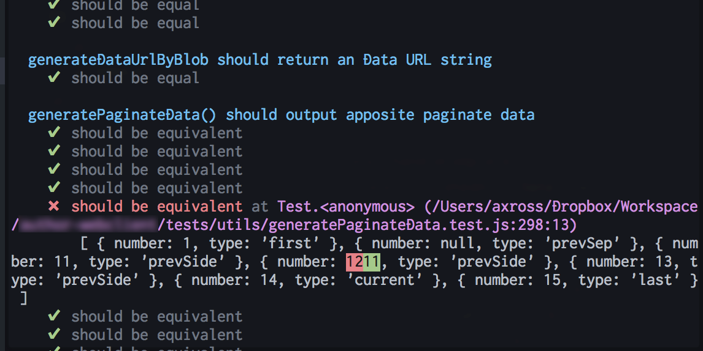
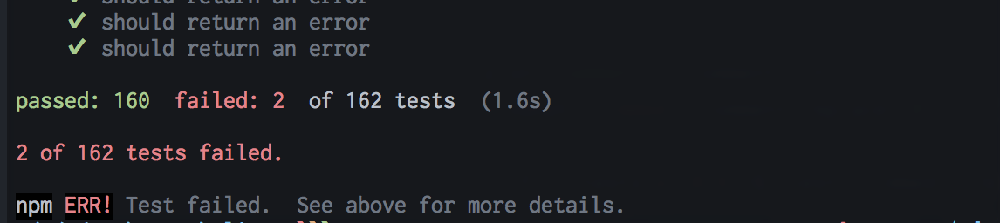

[](http://badge.fury.io/js/tipsi-tap-diff)





## How to use

```
npm install -g tipsi-tap-diff
```

```
tape ./*.test.js | tap-diff
```

tap-diff uses [chalk](https://www.npmjs.com/package/chalk) for adding color, which automatically detects
color terminals. If you're piping the output and want to force color:

```
FORCE_COLOR=t tape ./*.test.js | tap-diff
```

Or use with `createStream()`:

```javascript
'use strict'

const test = require('tape')
const tapDiff = require('tipsi-tap-diff')

const options = { bail: true }
const callback = () => {
 console.log('Complete callback')
}

test.createStream()
  .pipe(tapDiff(options, callback))
  .pipe(process.stdout)

test('timing test', (t) => {
  t.plan(2)
  t.equal(typeof Date.now, 'function')
  var start = Date.now()

  setTimeout(() => {
    t.equal(Date.now() - start, 100)
  }, 100)
})
```

## Options

```
Options:

  json[=indent]
    Output event data as JSON with the specified indentation (default=2)

  tap
    Output data as reconstituted TAP based on parsed results

  lines
    Output each parsed line as it is recognized by the parser

  bail
    Emit a `Bail out!` at the first failed test point encountered

  ignore-all-whitespace
    Skip over blank lines outside of YAML blocks

  omit-version
    Ignore the `TAP version 13` line at the start of tests
```

## License

MIT
